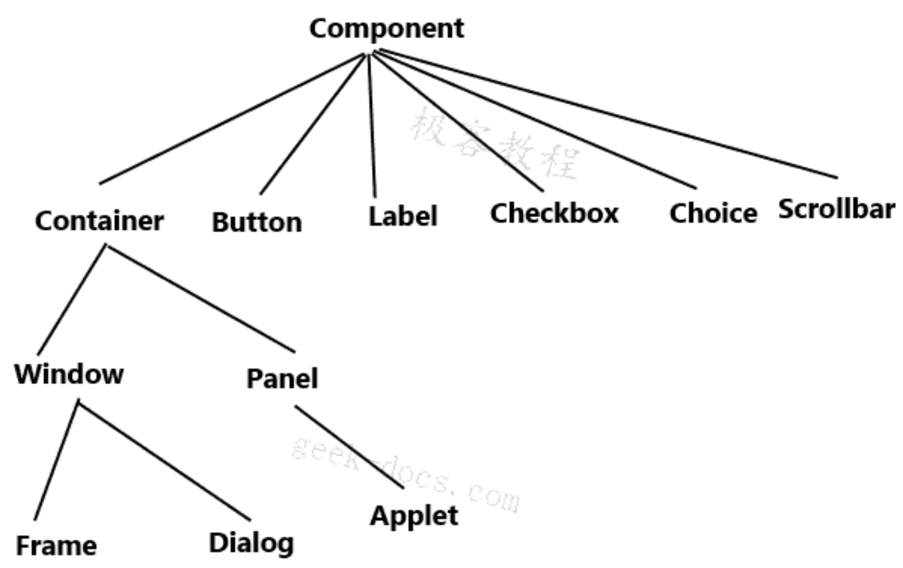

# java GUI

- 这是什么
- 他怎么玩
- 该如何去在我们平时运用？
- 组件
  - 窗口
  - 弹窗
  - 面板
  - 文本框
  - 列表框
  - 按钮
  - 图片
  - 监听事件
  - 鼠标
  - 键盘事件
  - 破解工具

做完就可以用来做外挂

## 简介

Gui的核心技术： Swing  AWT  是GUI的核心编程工具，现在不流行，因为不美观，还需要我们的jre环境! 太大了!

为什么我们要学习，因为他是MVC的基础，可以写出自己心中想要的小工具，工作的时候也可能维护到swing界面，概率极小，主要是为了了解MVC架构，了解监听!

## AWT

abstract windows toolkit

包含了很多类和接口



### `Frame` 窗口

`java.awt.Frame` 类

属于 `Container`

`Frame` 是顶级窗口（是一个独立的窗口，它不是其他窗口的子窗口。顶级窗口可以独立存在，不依赖于其他窗口。它有自己的标题和边框，可以被用户直接看到和操作）

**Constructor**

1. 空参构造
2. `Frame(String title)` 

    `title` 为窗口名

**Method**
1. `setBounds()` 
1. `setBackground()` 
1. `setResizable()` 
1. `setLayout()` 
1. `addWindowListener()` 
1. `add(Component component)` 
1. `setVisible()`
1. `setFont()`

**注意**

1. 创建一个窗口的时候，要调用
    - `setResizable()`
    - `setLayout()`
    - `setBounds()` 
    - `setBackground()`
    - `addWindowListener()`
    - `setVisible()`
    - `setFont()`
1. `setLayout()` 影响的是容器里面的东西，而不是容器本身
1. `setVisible()` 方法的使用顺序确实很重要:
    - **在添加所有组件后调用**：`setVisible(true)` 会导致窗口及其所有子组件被绘制。如果在调用 `setVisible(true)` 后添加组件，可能需要额外的步骤（如调用 `validate()` 和 `repaint()`）来确保新添加的组件被正确绘制。
    - **在设置布局和大小后调用**：布局管理器和窗口大小会影响组件的位置和大小。
    - **在 setUndecorated() 之前调用**：当使用 `setUndecorated()` 方法来移除窗口的装饰（如标题栏），在调用 `setVisible(true)` 之前调用 `setUndecorated(true)`。一旦窗口变为可见，就不能更改其装饰状态。
    - **在 dispose() 之后调用**：调用了 `dispose()` 来释放窗口的资源，通过调用 `setVisible(true)` 来重新创建窗口和其资源。
1. `setBounds()` 等效于 `setLocation()` + `setSize()`;
1. 要使用 `setBounds()` ，请将`frame.setLayout(null)`， 如果您使用各种布局，则 `setBounds()` 将不起作用

### 布局管理器

**FlowLayout**

```java
Frame frame = new Frame();
frame.setLayout(new FlowLayout(FlowLayout.***));
```

**BorderLayout**
```java
Frame frame = new Frame();
frame.setLayout(new BorderLayout());

frame.add(component, BorderLayout.***);
```

**GridLayout**
```java
Frame frame = new Frame();
frame.setLayout(new GridLayout(int row, int column));

frame.add(component)
frame.add(component)
frame.add(component)
```

**注意事项**
1. 给一个容器设置了布局之后，就不能使用 `setBounds()`, `setLocation()`, `setSize()`
2. 使用 `BorderLayout`要在容器调用 `add()` 方法的时候使用
1. `BorderLayout`，如果只给了一个 `NORTH`，那就就是 `NORTH` 会被沾满，但是别的地方是没被使用的，就是是一个大块的状态，如果要使用也只能通过`BorderLayout`
3. 使用 `GridLayout` 要在 `new` `GridLayout` 的时候设置好行列数，添加的时候就不用指定在哪行哪列，默认从左到右，从上到下添加
4. 所以一个容器如果被设置了 `BorderLayout`，最多只能往里面放五个组件吗？
    
    不完全是这样的。虽然 BorderLayout 将容器划分为五个区域（北、南、东、西和中心），并且每个区域默认只能添加一个组件，但是您可以通过在一个区域中添加一个容器（如 Panel 或 JPanel），然后在这个容器中添加多个组件，从而在一个区域中放置多个组件。
## `Panel` 面板

`java.awt.Pannel` 类

面板是内嵌在窗口的一个东西，所以是Frame对象.add(Pannel对象)

面板的坐标是相对于Frame对象的坐标

**方法**
1. `setBackground()`
2. `setLayout()`
3. `setBounds()`
3. `add()`

**注意事项**
1. 每 `new` 一个 `panel` 记得都要使用方法：
    - `setBackground()`
    - `setLayout()`
    - `setBounds()`
1. `panel` 是中间层窗口，不能独立存在，必须添加到其他窗口使用
1. 记得给 `panel` 设置一个颜色，不然就是 `frame` 的颜色，这样你看不出来你的 `panel` 在哪
2. `setBounds()` 的坐标相对的包括了程序的边框大小。非常非常重要的一点！！！！你用 `setBounds` 手动调坐标的时候，图形界面的顶部边框的宽度也是包括在坐标内的，也就是给 `frame` 加容器的时候，记得 `y` 坐标给加上边框的宽度，因为相对坐标也是从最右上角的点算的。另外一点就是，当你觉得你的代码，布局啥的都 ok 的时候，还是得不到想要的结果的时候，可以慢慢的调一调组件的位置和大小（建议把组件调到刚好可以显示标签的大小，就可以去动位置，看看是不是位置的问题了）
3. 很重要的一点还有：`panel` 里面的组件的 `setBounds()` 的时候的坐标也是相对 `frame` 的左上角的坐标！
5. `setBounds()` 的前两个参数，是指当前容器或组件，左上角坐标相对于 **该组件所在的容器** 左上角坐标差多少。

### `Button` 按钮

`java.awt.Button` 类

**构造**
```java
Button button = new Button(String title);
```

**方法**
1. `setBackground()`
2. `setForeground()`

**注意事项**
1. 每 `new` 一个按钮，就要使用：
    - `setFont()`


**事件监听**

`button.addActionListener()` 方法

## `TextField` 文本框

`java.awt.TextField` 类

**方法**
1. `setFont()`

**事件监听**

`addActionListener()` 方法

`addActionListener()` 里面传入的对象实现的方法是： `e.getSource()` ，然后强转型，操作   `textField` 对象

**注意事项**
1. 一新建一个 `textField` 对象，就要使用 `setEchoChar()` 方法。
2. `addActionListener()` 传入的对象的实现：

    使用 `ActionEvent` 对象 `e` 的 `getSource()` 方法得到 `textField` 的 `Object` 对象，进行强制类型转换，调用 `textField` 的 `getText()` 方法可以得到输入在文本框的内容。

## 练习

简易计算器，并且分别使用组合类和内部类进行代码优化

有个Label类，也可以add到frame里面去


## 画笔

`java.awt.Frame.paint()`

需传入一个 `Graphics` 对象，用该对象实现绘图。

**Graphics 中的方法**
1. `setColor()`
2. `fillOval()`
2. `fillRect()`
2. `drawLine()`
3. `repaint()`

`fill` 系列和 `draw` 系列的方法的区别就是图形是实心和空心得区别


**注意事项**
1. 每次使用 `Graphics` 对象都要使用 `setColor()` 和 `repaint()`（最后） 方法
1. 重写 `Frame` 的 `paint()` 方法，在 `paint()` 里面操作 `Graphics` 对象实现绘图。
2. `setVisible()` 和 `repaint()` 的区别
    - `setVisible()`：因为组件被新建的时候，是默认不可见的，就需要把 `frame.setVisible(true)` 一下。
    - `repaint()`：当你的GUI组件的显示内容需要更新时，例如，如果你的程序包含一个绘图组件，用户可以通过鼠标来改变绘图，那么每次鼠标事件发生时，你可能就需要调用另一个例子是，如果你的程序有一个显示动态数据（如实时股票价格）的组件，你可能需要定期调用 `repaint()` 来更新显示的数据

**案例：画图工具**

鼠标监听事件：因为鼠标（比如单击, 英文叫press）的对象是窗口（如果是针对画图工具的话），那么就是 e.getResource()返回的是Frame对象，可以得到你点击的x，y坐标

用Point类把x，y坐标转化为点

那么怎么存点呢？存东西有集合类和Map类，map感觉更像键值对，就是你要用的话你得知道键，但你都存起来了，怎么知道呢？那就是集合，但我们的点有x，和y两个属性啊，一个一个存在集合不会乱吗？不会，还记得泛型吗？/偷笑，对，集合里面存Point对象不就好了！！！

然后去用frame.paint方法，把这个点画出来。

然后不能只画一次，要每次都刷新，再调用frame.repaint()方法

**注意： `repaint()` 的实现就是重新调用 `paint()` 方法，绝对不能在 `paint()` 里面调用 `repaint()` 方法，程序程序会一直调用 `paint()`, 陷入无限循环**

## 鼠标监听

`addMouseListener()` 方法

**注意事项**
1. 各个容器都可以有鼠标监听事件，只要调用这个容器的 `addMouseListener()` 方法即可
2. 该方法传入 `MouseEvent` 参数，使用 `e.getX()` 和 `e.getY()` 获取点击位置的坐标

## 窗口监听事件

`addWindowListner()`

同鼠标监听事件。

## 键盘监听事件

`addKeyListener()`

同鼠标监听事件。

# Swing

## 窗口、面板

JFrame 类

窗口关闭事件被封装了：setDefaultCloseOperation(WindowConstants.里面有些参数)

### Container

**与 awt 不同的地方：frame 设置颜色设置的是 Container 的颜色，所以通过 JFrame.getContentPane() 得到容器，用 Container 对象接收**

然后给 container 设置颜色就好了。

然后，要在 JFrame 里面放东西，都是放在 Container 里面，如 button, label 等等 


## Dialog 对话窗口（弹窗）

明确一点的是：对话窗口也是一个 Frame 或者说 JFrame

但是弹窗用的是 JDialog 类了，不是 JFrame，可以去源码看看 JDialog 类是个什么情况，其实他里面用的东西都是 JFrame 的东西。

**注意**

1. JDialog 里面自动封装了 setDefaultCloseOperation(WindowConstants.里面有些参数) 方法，你就不用给它加了。

## JLabel

JLabel 对应 awt 里面的 Label 类

给 label 居中，用 Label 的 setHorizontalAlignment() 方法

里面传入的是一个 int 类型，可以用 SwingConstants.各种方式

JLabel label = new JLabel("");

## Icon 图标

Icon 可以放在 Label 上，也可以放在 JButton 上

还有 ImageIcon，把图片作为图标

然后要把 icon 放在标签上，可以用 Label 的构造，也可以用Label.setIcon方法。

**注意**
通过类可以获得这个类同级目录下的东西：
`Class.class.getResource("文件名")`


## JPanela 面板

用 JPanel 类

有个可以传 Layout 的构造，这里我们可以传入一个GridLayout。

pannel 的 add 方法

然后一个 pannel 对象可以 add 多少个东西是有 GridLayout 设定的布局数决定的。

**注意**

1. JFrame 返回的 Container 可以通过 GridLayout 传入一个水平间距和垂直间距的参数

### JScrollPanel 滚动条

它的一个构造就是把一个组件放进去，就可以对其实现滚动条功能，如把 JTextArea 对象放进去，当输入的内容超出了文本框的大小，就会出现滚动条。

## 按钮

### 普通按钮

JButton， 他有一些方法可以去看看。

JButton.setToolTipButton()就是你鼠标悬浮在按钮上会出现的文字提示。

### 单选按钮

JRadioButton()，在构造内可以给按钮的文本

可以 new 多个对象，然后对多个对象进行分组之后，然后同一组里面的按钮，只能选中一个按钮。

那么就有一个组对象，ButtonGroup，使用 add 方法把组员加进来

**注意**
 
1. 最后使用 container add组件的时候不用把 ButtonGroup 对象add，add JRadioButton 对象就行了

### 复选按钮

JCheckBox

直接new 出多个JCheckBox对象，把这些按钮add到container里面去，就是一组复选按钮了，不用分组。

## 列表

### 下拉框

JComboBox 

用里面的 addItem 方法来加选项

### 列表框

JList

可以在构造的时候传入一个 String[]

直接就得到了这个 String[] 表示的列表

## 文本框

### 文本框

JTextField

### 密码框

JPasswordField

### 文本域

JTextArea

# 小结

以上这些内容对你理解后面的东西是有帮助的，以后这块的内容会搬到前端

# 其他知识小点

1. 适配器模式
    
    因为你想用一个接口就得重写他里面的所有方法，这时候会有一个这个接口的适配器类（就是个类，只不过我们叫他适配器），一般是接口名称后面加上一个Apapter就是了，这个类实现了接口里面的所有方法，但是实现的是空方法，但是你继承这个类的时候就不用重写全部方法了，你可以只重写你需要的方法就行了。